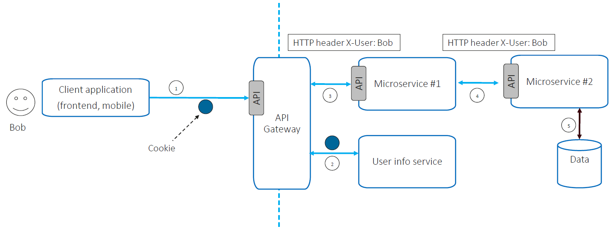

# microservice-identity-propagation

When building multi user or tenant system composed of many microservices you will need to consider how identity is propagated between internal services.This can be achieved by including a caller context (e.g. user ID, user roles/groups) in all calls to downstream internal microservices.

In the following diagram taken from the [OWASP Microservices Security Cheat Sheet](https://cheatsheetseries.owasp.org/cheatsheets/Microservices_security.html) we can see an example of this.

The OWASP document outlines some important attributes / recommendations / guidelines for identity propagation:

1. Decouple external and internal identity representations.
2. Implement some sort of internal user / session service to enable enrichment of user data prior to propagation to internal services.
3. Ensure the identity information is signed by the service which is calling on the users behalf.
4. Logging / Auditing of these flows is really important, ensuring you have a complete picture of the call flow, and caller context in each event.
5. The calling context is provided at the transport layer, rather than being embedded as an argument to every REST call.
6. Internal entity representation structure must not be exposed outside.  

# References

* [OWASP Microservices Security Cheat Sheet](https://cheatsheetseries.owasp.org/cheatsheets/Microservices_security.html)